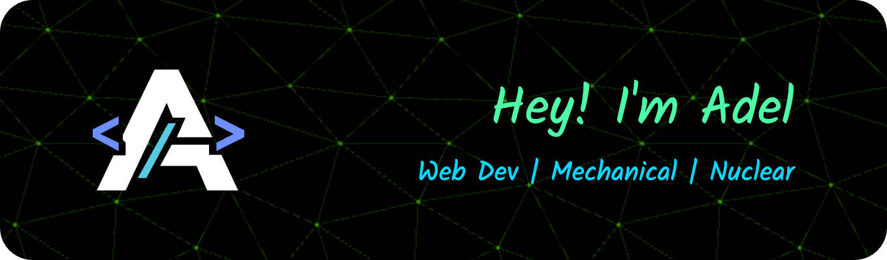

<!--
**adelansari/adelansari** is a ✨ _special_ ✨ repository because its `README.md` (this file) appears on your GitHub profile.

Here are some ideas to get you started:

- 🔭 I’m currently working on ...
- 🌱 I’m currently learning ...
- 👯 I’m looking to collaborate on ...
- 🤔 I’m looking for help with ...
- 💬 Ask me about ...
- 📫 How to reach me: ...
- 😄 Pronouns: ...
- ⚡ Fun fact: ...
-->

### About me

<!--  -->

- 🔭 Passionate about web development, constantly tinkering with frontend and full-stack apps. Video games and modding are my other loves.
- 🌱 Always learning
  - Learning: PHP, Angular
  - Improving: Typescript, React, Next.js, C# and .NET
  - Interested: Machine Learning
- I draw digitally sometimes with my old tablet using ibisPaint X.
- Math wizard

  

<h3>Skills</h3>

- **Languages:** JS, TS, C#, Go, PHP, Py, C++, VB
- **Frontend:** React, Redux, Next, Angular, Styling (MUI, Bootstrap, Tailwind)
- **Backend:** Node.js, Express, .NET, Django, Laravel, Symfony, PostgreSQL
- **Mobile:** React Native
- **DevOps and Cloud:** Docker, Kubernetes, GitHub Actions, Azure
- **Game Engines:** Unity, Godot
- **Others:** Matlab, RESTful APIs, Tableau, LaTeX

  

### Stats

  
  

### Connect with me:

  

<!-- ### Random Dev Meme

 -->
